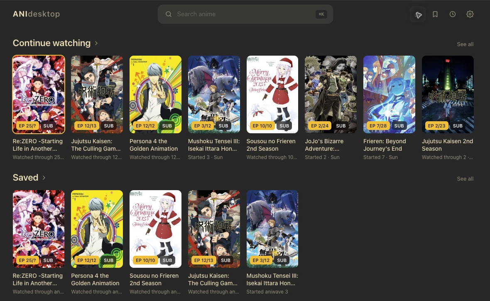
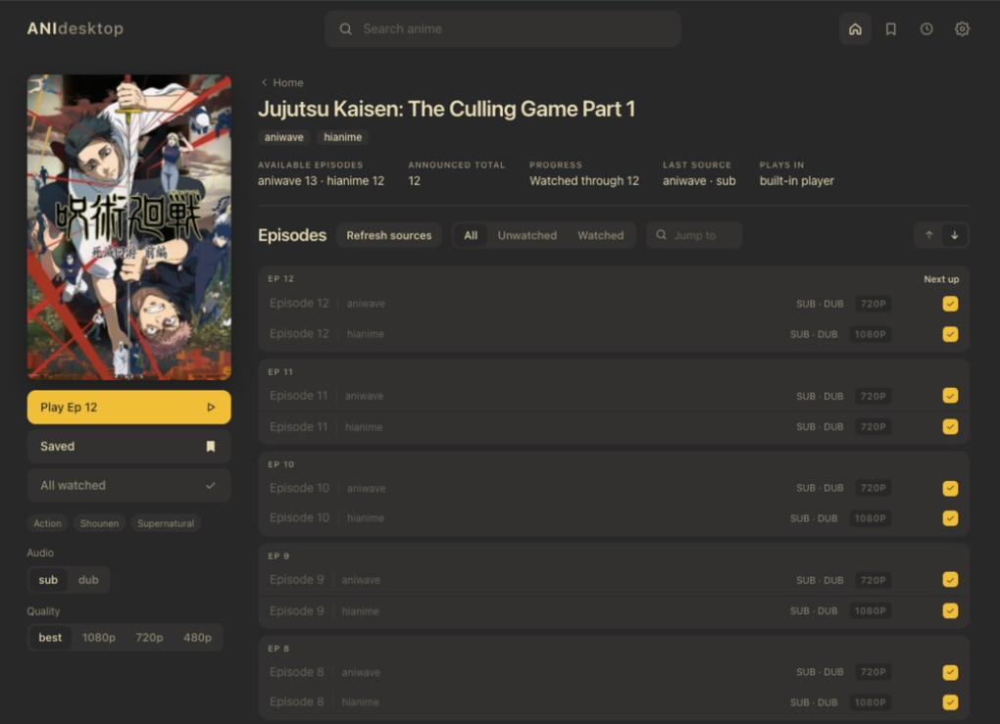
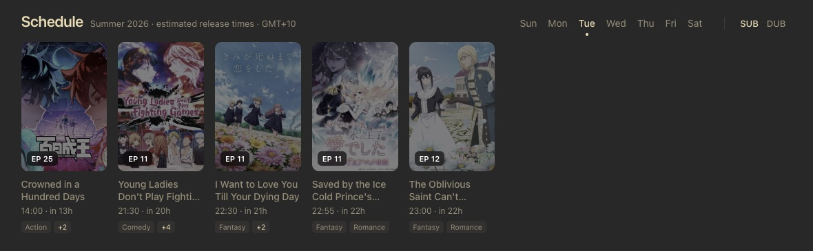
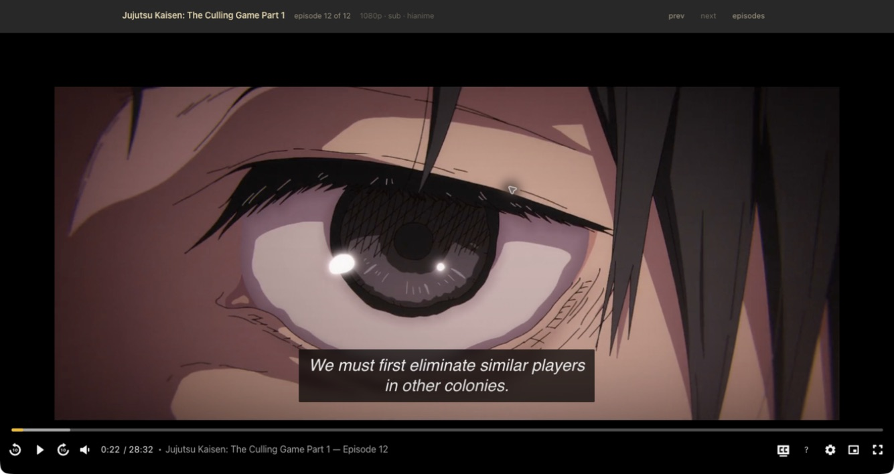
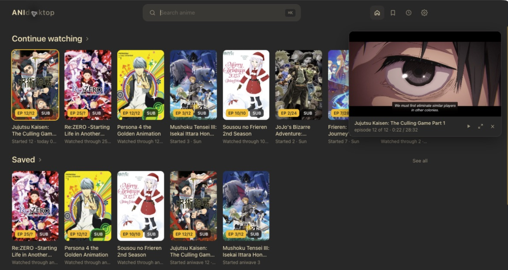

<p align="center">
  
</p>

<h1 align="center">ANIdesktop</h1>

<p align="center">
  Browse, watch, and keep track of anime in one desktop app.<br>
  Built on ani-cli, for Windows, macOS, and Linux.
</p>

<p align="center">
  <a href="#getting-started">Get started</a> ·
  <a href="#features">Features</a> ·
  <a href="./desktop-app/README.md">Technical guide</a> ·
  <a href="https://github.com/HanifiNF/Ani-cli-aniwave/issues">Report an issue</a>
</p>

ANIdesktop brings anime search, your library, a release schedule, and a built-in video player into one app. Find a series across providers, save it for later, and pick up where you left off.

Built on [ani-cli](https://github.com/pystardust/ani-cli), created by [pystardust](https://github.com/pystardust) and developed by [its contributors](https://github.com/pystardust/ani-cli/graphs/contributors). Their work provides the foundation for this app.



## Features

- **Search across sources.** Search AniWave/Vidplay, AniDB, and HiAnime together. Matching titles are combined, with provider choices grouped under each episode.
- **Explore related anime.** Click a series genre or AniList tag to open Browse with that filter selected, or click a studio to search its name. Each click starts a fresh browse view.
- **Keep your place.** Save titles, track watched episodes, and return through Continue watching. Built-in playback saves resume positions and advances your next-play choice when an episode finishes.
- **See what's airing.** Browse the seasonal schedule by day and SUB/DUB, with local release times, countdowns, posters, and genres.
- **Watch inside the app.** Choose quality, captions where available, playback speed, picture in picture, and native fullscreen. Optional autoplay starts the next episode after a five-second countdown.
- **Browse while watching.** Dock playback into a resizable corner player, drag it to any corner, and expand it when you're ready. Its size and corner are remembered.
- **Make it yours.** Choose theme presets or custom colours, set preferred audio and quality, and control which sources are enabled. Settings includes source status and retry controls.
- **Use your preferred player.** mpv, VLC, and IINA are supported as optional external players.

Bookmarks, history, settings, and resume positions are stored locally. Catalog and stream availability depend on the enabled providers. Cached episode lists and schedule entries remain visible during outages, with status notices.

<details>
<summary><strong>Explore the app: series, schedule, and player screenshots</strong></summary>

### Series and sources

Choose an episode and provider, check audio and quality availability, and manage watched progress from the series page.



### Release schedule

The schedule uses your local timezone. AniWave supplies estimated release times and must be enabled for live schedule updates.



### Built-in player

Playback controls, captions, seeking, and fullscreen are available inside the app.



### Corner player

Keep an episode open while browsing your library.



</details>

## Getting started

### Run from source

Install Node.js 22 or newer and Git. npm is included with Node.js.

```sh
git clone https://github.com/HanifiNF/Ani-cli-aniwave.git
cd Ani-cli-aniwave/desktop-app
npm ci
npm start
```

`npm start` builds and launches ANIdesktop on Windows, macOS, or Linux. For an existing checkout, run the npm commands from `desktop-app/`. Built-in playback is included; external players are optional.

### Desktop packages

Check the repository's [Releases page](https://github.com/HanifiNF/Ani-cli-aniwave/releases) for published builds. Each night at 2:17 AM Brisbane time (16:17 UTC), the [desktop release workflow](./.github/workflows/desktop-release.yml) checks `master` for changes since the last published stable release. When changes exist, it runs the desktop checks, builds these packages, and publishes one release with an automatically incremented patch version:

| Platform | Package |
| --- | --- |
| Windows x64 | `.exe` installer with a selectable install location |
| macOS Apple Silicon | arm64 `.dmg` |
| macOS Intel | x64 `.dmg` |
| Linux x64 | `.AppImage` |

macOS packages use ad-hoc signatures and are currently unnotarized. For a build you trust, attempt to open it, then use **System Settings → Privacy & Security → Open Anyway** if macOS blocks the first launch. The original `v0.1.0` Mac packages contain an invalid signature and should be replaced with a newer build.

To create a package from your checkout, see [Building and development](#building-and-development).

## Using ANIdesktop

1. **Find a series.** Type at least two characters in the search bar, or press Enter to search immediately. Open a result to see its details and episodes.
2. **Choose how to watch.** Select SUB or DUB and your preferred quality, then click an episode's provider row to play it.
3. **Save and continue.** Save a series from its sidebar and return through Saved or Continue watching. Episode checkboxes let you mark watched progress manually.
4. **Browse during playback.** Escape closes an open player menu, leaves fullscreen, then docks the player on subsequent presses. Use the corner player's expand button to return to the full view.

### Keyboard controls

| Shortcut | Action |
| --- | --- |
| ⌘K / Ctrl+K, or `/` | Focus search while browsing |
| Space / K | Play or pause in the player |
| Left / Right | Seek 10 seconds |
| Up / Down | Adjust player volume |
| M | Mute |
| F | Toggle fullscreen in the player |
| Escape | Close the player menu, leave fullscreen, then dock playback |
| Backtick | Expand the corner player while browsing the library or search results |
| ? | Show shortcuts for the current view |

Text fields, menus, and sliders retain their own keyboard controls. See the [desktop guide](./desktop-app/README.md#using-the-app) for the full player reference.

### External players

In Settings, select **Playback → external** and set the **External player** executable or full path. For IINA installed in Applications on macOS, use:

```text
/Applications/IINA.app/Contents/MacOS/iina-cli
```

You can also keep built-in playback selected and configure an external player for the player's **Open in external player** fallback. ANIdesktop supplies the referrer and HLS options needed by supported players. Resume positions and end-of-episode completion tracking apply to built-in playback; external-player history records launches.

## Troubleshooting

- **Search or episodes fail to load:** check source status in Settings. Use **Check now** or **Retry**, or choose another enabled source. **Refresh sources** updates the current series while preserving cached results during an outage.
- **A stream fails:** use the player's **Retry** button to resolve a fresh stream, select another source, or use a configured external player.
- **Changes are missing after updating:** quit the app completely, including **⌘Q** on macOS. After updating a source checkout, run `npm ci` and `npm start` again from `desktop-app/`.
- **Investigate a playback issue:** enable **Diagnostics** in Settings and save, reproduce the issue, then select **open logs**. Copy `media-player.jsonl` promptly: it retains the latest five minutes of events. Diagnostics are stored locally and are off by default.

When [reporting an issue](https://github.com/HanifiNF/Ani-cli-aniwave/issues), include your OS, app version or commit, provider, steps to reproduce, and relevant errors or diagnostic logs. The [technical guide](./desktop-app/README.md) covers logging, platform behavior, and source recovery in more detail.

## Building and development

ANIdesktop uses Electron, React, and TypeScript, with Vidstack and hls.js for built-in playback. Its catalog and playback services run independently of the ani-cli shell script.

Run these commands from `desktop-app/` after installing dependencies:

| Command | Purpose |
| --- | --- |
| `npm run dev` | Start Electron with the Vite development server |
| `npm test` | Run unit tests |
| `npm run typecheck` | Check renderer and Electron TypeScript |
| `npm run build` | Build the renderer, Electron code, and app icons |
| `npm run test:player` | Exercise real HLS playback, requires ffmpeg on PATH |
| `npm run test:player:native` | Also exercise native window and fullscreen behavior |
| `npm run dist:win` | Build the Windows installer |
| `npm run dist:mac` | Build Intel and Apple Silicon DMGs on macOS |
| `npm run dist:linux` | Build the Linux AppImage |

Packages are written to `desktop-app/release/`. The [desktop guide](./desktop-app/README.md) documents the code layout, local storage, provider caching, security boundary, and release process. [Design notes](./desktop-app/design/README.md) describe the current interface and screenshot workflow.

## Terminal client

The customized [ani-cli script](./ani-cli) remains available for terminal use, with AniWave and AniDB adapters, bookmarks, downloads, and an optional Tkinter picker. See the [CLI guide](./docs/cli.md) for requirements, setup, and examples.

## Credits and contributing

ANIdesktop is made by [Hanifi](https://github.com/HanifiNF) and [Pascal](https://github.com/Pascalrjt).

Our thanks to [pystardust](https://github.com/pystardust), the creator of [ani-cli](https://github.com/pystardust/ani-cli), and [everyone who has contributed to it](https://github.com/pystardust/ani-cli/graphs/contributors). Their search, episode-selection, and playback workflow is the foundation of ANIdesktop.

Thanks also to the [Sparkle Project](https://github.com/sparkle-project/Sparkle) and its contributors for the macOS update framework that powers signed update downloads, installation, and relaunch in ANIdesktop.

Bug reports and contributions are welcome. See [CONTRIBUTING.md](./CONTRIBUTING.md) for repository guidelines and the commands above for desktop checks.

The project is licensed under [GPL-3.0](./LICENSE). See the [third-party notices](./desktop-app/THIRD_PARTY_NOTICES.md) for bundled dependencies. Catalog information and streamed media come from external providers; availability depends on those services. See the [disclaimer](./disclaimer.md).
